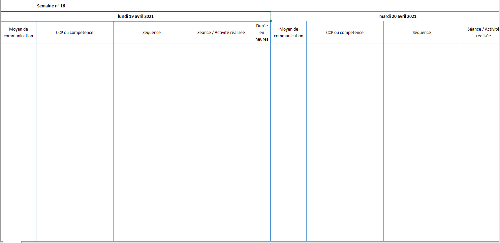
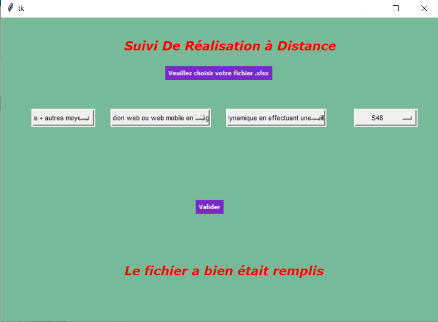
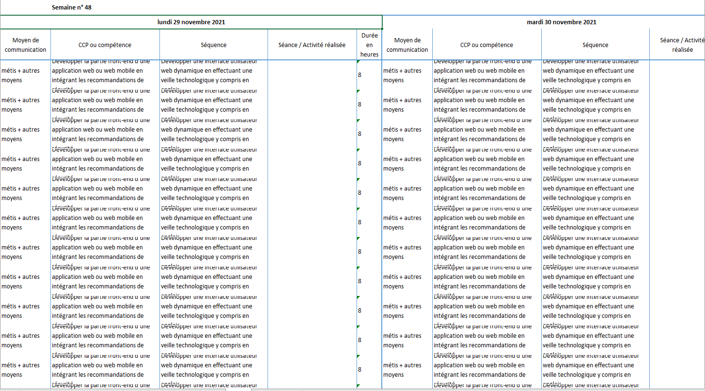

## WriteOn Excel

* i created this project because , in my work, i must complete this file excel ,from Monday to Friday for each student:

### I am lazy, so I ​make this program that allows me to fill it in some clicks :

### AND TADA ! the file is completed :

